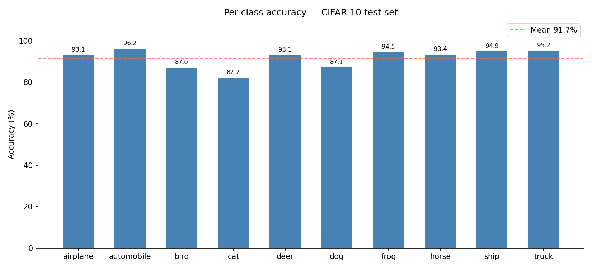
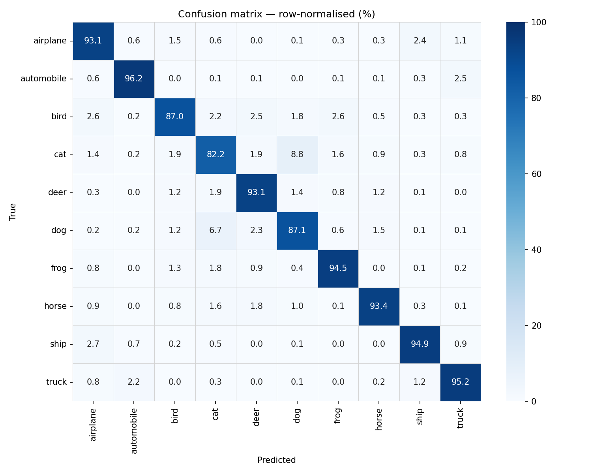

# ResNet-CIFAR10

[](https://github.com/h0rvex/resnet-cifar10/actions/workflows/ci.yml)
[](https://www.python.org/downloads/release/python-3110/)

CIFAR-style **ResNet (v1) from scratch** in PyTorch with a small, testable training stack: typed config, YAML + CLI overrides, JSONL + TensorBoard metrics, checkpoints with **run provenance** (`run_info.json`, git/torch/CUDA metadata), mixed precision on CUDA, and CI.

Training and evaluation follow the **L = 6n + 2** recipe from [He et al. (2015), §4.2](https://arxiv.org/abs/1512.03385): **n** basic (two-conv) blocks per stage, three stages at 16 / 32 / 64 channels, stride-2 at the first block of stages 2 and 3, projection shortcuts when shapes disagree, then global average pooling and a linear classifier.

## Results and naming (paper alignment)

| Variant | Depth `L` | Blocks per stage `n` | Params (approx.) | Notes |
| ------- | --------- | -------------------- | ---------------- | ----- |
| **ResNet-14** (legacy stack) | 14 | 2 | **0.175 M** | Earlier versions of this repo used **six** residual blocks (2 per stage) while calling the model “ResNet-20.” Under He et al.’s counting, that stack is **ResNet-14**. A single Tesla T4 run with the pinned recipe reached **91.67%** top-1 (paper: **91.25%** for a true ResNet-20). Figures in `artifacts/` correspond to that legacy run. |
| **ResNet-20** (default now) | 20 | 3 | **~0.27 M** | Paper-aligned width/depth; use `model_depth: 20` in YAML. **Re-run training** to refresh headline accuracy, FLOPs, and throughput on your hardware. |

*Optimization recipe (unchanged): SGD + momentum 0.9 + Nesterov, weight decay 5e-4, linear warmup 5 epochs → cosine anneal to 0 over 200 epochs, label smoothing 0.1, fp16 autocast on CUDA. Throughput metrics exclude first-batch warmup.*




## Reproduce

```bash
pip install -e .
python scripts/train.py --config configs/resnet20.yaml --seed 42
python scripts/evaluate.py --checkpoint runs/<timestamp>/best.pth
```

Each run writes `runs/<timestamp>/config.yaml`, `metrics.jsonl`, TensorBoard logs under `tb/`, **`run_info.json`** (config + provenance), and `best.pth` / `last.pth`. Checkpoints store the same provenance dict for traceability.

**Legacy checkpoints** saved before `model_depth` was added are still supported: `scripts/evaluate.py` infers depth from the weight tensor layout (so ResNet-14 weights load correctly).

Determinism: same seed and GPU architecture should give bitwise-identical training trajectories where PyTorch and cuDNN allow it (`warn_only` deterministic mode is enabled).

## Multi-seed aggregation

```bash
python scripts/multi_seed.py --config configs/resnet20.yaml --seeds 41 42 43
# or: make multi-seed
```

Writes `runs/multi_seed_<timestamp>/summary.json` with **mean ± sample stdev** of best test accuracy and per-seed wall times.

## Other depths

YAML presets: [`configs/resnet20.yaml`](configs/resnet20.yaml), [`configs/resnet32.yaml`](configs/resnet32.yaml), [`configs/resnet56.yaml`](configs/resnet56.yaml) (`model_depth` must satisfy **L = 6n + 2**). Build in code with `make_resnet_cifar(depth, num_classes)`.

## Hardware (legacy headline run)

| GPU      | VRAM  | Epoch time | Total wall-clock |
| -------- | ----- | ---------- | ---------------- |
| Tesla T4 | 16 GB | 11.4 s     | ~38.0 min        |

*(Above wall-clock applied to the historical ResNet-14 stack at batch 128.)*

## What this project demonstrates

- Paper-faithful **depth counting** and an explicit **migration story** for an earlier naming mistake (important for reviewer-facing repos).
- Small **library-first** training API (`resnet_cifar10.train.train`) with a thin CLI, contract tests on config merge and checkpoints, and optional coverage in CI.
- Honest reporting: limitations stay explicit; multi-seed tooling addresses single-seed variance when you need it.

## Deployment-shaped notes

Inputs are fixed **32×32×3** tensors after normalization; the core model is a standard `nn.Module` suitable for tracing or `torch.export` in a follow-up. This repo stops at training/eval and artifact export—no TensorRT or embedded deployment pipeline is claimed.

## Limitations

- Headline plots in `artifacts/` are tied to the **legacy ResNet-14** run until you regenerate them with the current default depth.
- No adversarial / OOD / calibration study; deliberately out of scope.
- Strong reproducibility still depends on GPU driver and PyTorch builds; provenance fields help audit what produced a checkpoint.

## References

- Kaiming He, Xiangyu Zhang, Shaoqing Ren, Jian Sun. *Deep Residual Learning for Image Recognition*. CVPR 2016. [arXiv:1512.03385](https://arxiv.org/abs/1512.03385).
